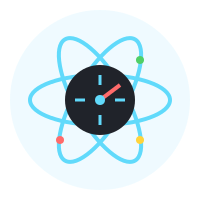

<div align="center">
  
  <h1>React Performance Optimizer (RPO)</h1>
  <p>
    <strong>🚀 Supercharge your React application's performance with automated insights and optimizations</strong>
  </p>
  <p>
    <a href="https://www.npmjs.com/package/react-performance-optimizer">
      
    </a>
    <a href="https://www.npmjs.com/package/react-performance-optimizer">
      
    </a>
    <a href="https://github.com/yourusername/react-performance-optimizer/blob/main/LICENSE">
      
    </a>
  </p>
</div>

---

## ✨ Features

- 📊 **Real-time Performance Monitoring**
  - Track component render times
  - Identify unnecessary re-renders
  - Monitor component update frequencies

- 🎯 **Smart Optimization Suggestions**
  - Get actionable recommendations
  - Learn when to use React.memo
  - Optimize hooks and dependencies

- 📈 **Beautiful Visualization**
  - Color-coded performance metrics
  - Interactive component tree
  - Real-time performance graphs

- 🔧 **Easy Integration**
  - Zero configuration needed
  - Minimal performance overhead
  - TypeScript support out of the box

## 🚀 Quick Start

### Installation

```bash
npm install react-performance-optimizer
# or
yarn add react-performance-optimizer
```

### Basic Usage

```jsx
import { RPOWrapper } from 'react-performance-optimizer';

function App() {
  const handlePerformanceReport = (report) => {
    console.log('Performance Report:', report);
  };

  return (
    <RPOWrapper onReport={handlePerformanceReport}>
      <YourApp />
    </RPOWrapper>
  );
}
```

## 📖 Detailed Usage

### Performance Monitoring

Wrap your components with `RPOWrapper` to start monitoring:

```jsx
import { RPOWrapper, PerformanceVisualizer } from 'react-performance-optimizer';

function Dashboard() {
  const [reports, setReports] = useState([]);

  return (
    <div>
      <RPOWrapper 
        onReport={setReports}
        threshold={16} // Performance threshold in ms
        reportInterval={5000} // Report frequency in ms
      >
        <YourComponents />
      </RPOWrapper>
      
      {/* Beautiful performance visualization */}
      <PerformanceVisualizer reports={reports} />
    </div>
  );
}
```

### Optimization Examples

#### Before Optimization
```jsx
const ExpensiveComponent = ({ value }) => {
  // Expensive calculation on every render
  const result = Array(value)
    .fill(0)
    .reduce((acc) => acc + Math.random(), 0);

  return <div>{result}</div>;
};
```

#### After Optimization
```jsx
const OptimizedComponent = React.memo(({ value }) => {
  // Memoized calculation
  const result = useMemo(() => {
    return Array(value)
      .fill(0)
      .reduce((acc) => acc + Math.random(), 0);
  }, [value]);

  return <div>{result}</div>;
});
```

## 🎨 Visualization Features

The `PerformanceVisualizer` component provides:

- 📊 **Render Time Graphs**
  - Visual representation of component performance
  - Color-coded performance indicators
  - Real-time updates

- 🎯 **Optimization Suggestions**
  - Context-aware recommendations
  - Best practices guidance
  - Code examples

- 🌳 **Component Tree Analysis**
  - Hierarchical performance view
  - Re-render cascades
  - Update frequency tracking

## ⚙️ Configuration Options

```typescript
interface RPOWrapperProps {
  // Callback for performance reports
  onReport?: (report: PerformanceReport[]) => void;
  
  // Performance threshold in milliseconds
  threshold?: number;
  
  // Report generation interval
  reportInterval?: number;
  
  // Your React components
  children: ReactNode;
}
```

## 📊 Performance Report Structure

```typescript
interface PerformanceReport {
  componentId: string;
  averageRenderTime: number;
  renderCount: number;
  suggestions: string[];
  lastRenderTimestamp: number;
}
```

## 🤝 Contributing

We welcome contributions! Please feel free to submit a Pull Request. For major changes, please open an issue first to discuss what you would like to change.

## 📝 License

MIT 

---

<div align="center">
  <p>
    <sub>Built with ❤️ by developers, for developers</sub>
  </p>
</div>
